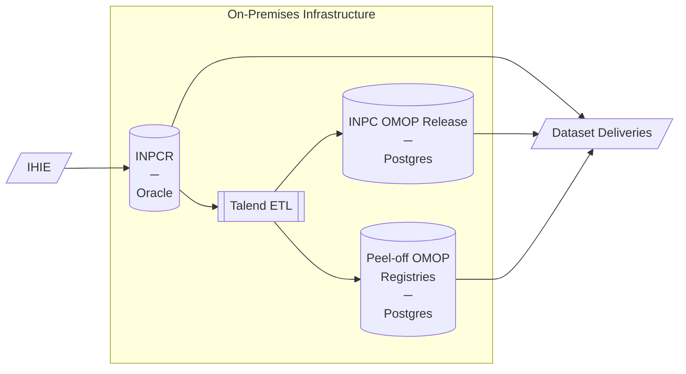
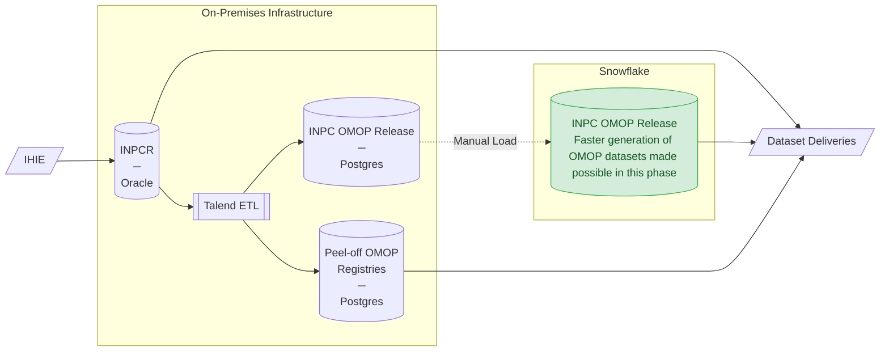
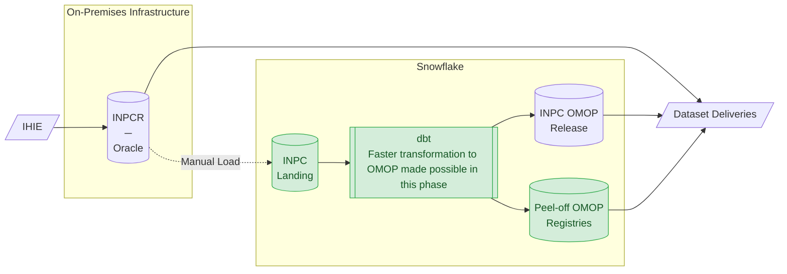
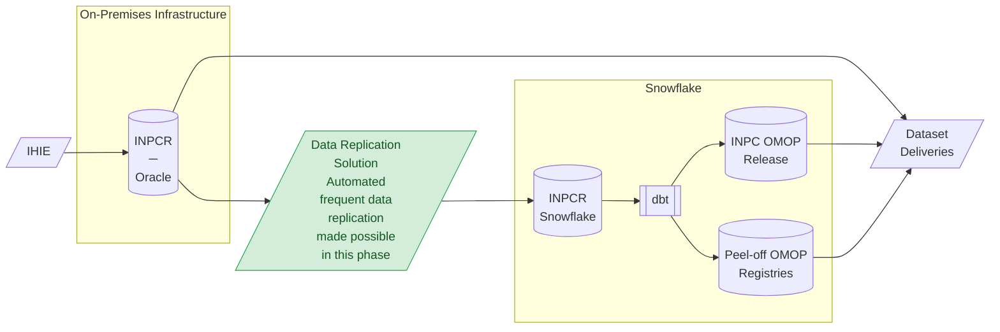

# documentation

Before:

```mermaid
  flowchart LR
      ExtData[/"IHIE"/]

      subgraph onprem["On-Premises Infrastructure"]
          INPCR[("INPCR\n─\nOracle")]
          Talend[["Talend ETL"]]
          OMOP[("INPC OMOP Release\n─\nPostgres")]
          Registries[("Peel-off OMOP\nRegistries\n─\nPostgres")]
      end

      Deliveries[/"Dataset Deliveries"/]

      ExtData --> INPCR
      INPCR --> Talend
      INPCR --> Deliveries
      Talend --> OMOP
      Talend --> Registries
      OMOP --> Deliveries
      Registries --> Deliveries
```

After Phase 1:

```mermaid
  flowchart LR
      ExtData[/"IHIE"/]
      subgraph onprem["On-Premises Infrastructure"]
          INPCR[("INPCR\n─\nOracle")]
          Talend[["Talend ETL"]]
          OMOP_PG[("INPC OMOP Release\n─\nPostgres")]
          Registries[("Peel-off OMOP\nRegistries\n─\nPostgres")]
      end

      subgraph snowflake["Snowflake"]
          OMOP_SF[("INPC OMOP Release\nFaster generation of OMOP datasets made possible in this phase")]
      end

      Deliveries[/"Dataset Deliveries"/]

      ExtData --> INPCR
      INPCR --> Talend
      INPCR --> Deliveries
      Talend --> OMOP_PG
      Talend --> Registries
      OMOP_PG -.->|"Manual Load"| OMOP_SF
      OMOP_SF --> Deliveries
      Registries --> Deliveries

      classDef newNode fill:#d4edda,stroke:#28a745,color:#155724
      class OMOP_SF newNode
```

After Phase 2:

```mermaid
  flowchart LR
      ExtData[/"IHIE"/]                                                            
      subgraph onprem["On-Premises Infrastructure"]
          INPCR[("INPCR\n─\nOracle")]
      end                                                                                           
      subgraph snowflake["Snowflake"]
          INPCR_SF[("INPC\nLanding")]
          dbt[["dbt\nFaster transformation to OMOP made possible in this phase"]]
          OMOP_SF[("INPC OMOP\nRelease")]
          Registries_SF[("Peel-off OMOP\nRegistries")]
      end

      Deliveries[/"Dataset Deliveries"/]

      ExtData --> INPCR
      INPCR --> Deliveries
      INPCR -.->|"Manual Load"| INPCR_SF
      INPCR_SF --> dbt
      dbt --> OMOP_SF
      dbt --> Registries_SF
      OMOP_SF --> Deliveries
      Registries_SF --> Deliveries

      classDef newNode fill:#d4edda,stroke:#28a745,color:#155724
      class INPCR_SF,dbt,Registries_SF newNode
```

After Phase 3:

```mermaid
  flowchart LR
      ExtData[/"IHIE"/]                                                            
      subgraph onprem["On-Premises Infrastructure"]
          INPCR[("INPCR\n─\nOracle")]
      end                                                                                           
      subgraph snowflake["Snowflake"]
          INPCR_SF[("INPCR\nSnowflake")]
          dbt[["dbt"]]
          OMOP_SF[("INPC OMOP\nRelease")]
          Registries_SF[("Peel-off OMOP\nRegistries")]
      end

      Replication[/"Data Replication\nSolution\nAutomated\nfrequent data\nreplication\nmade possible\nin this phase"/]
      Deliveries[/"Dataset\nDeliveries"/]

      ExtData --> INPCR
      INPCR --> Deliveries
      INPCR --> Replication
      Replication -->INPCR_SF
      INPCR_SF --> dbt
      dbt --> OMOP_SF
      dbt --> Registries_SF
      OMOP_SF --> Deliveries
      Registries_SF --> Deliveries

      classDef newNode fill:#d4edda,stroke:#28a745,color:#155724
      class Replication newNode
```
